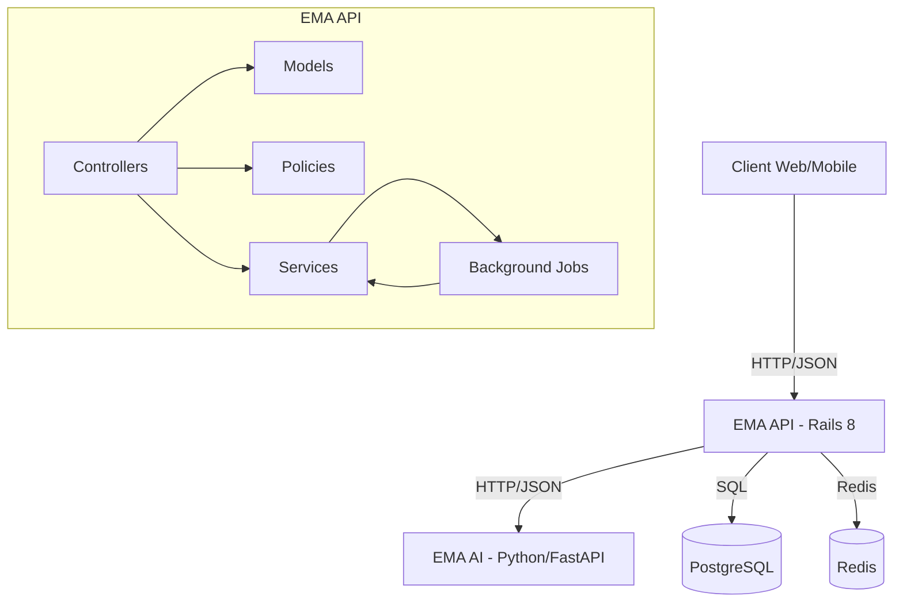
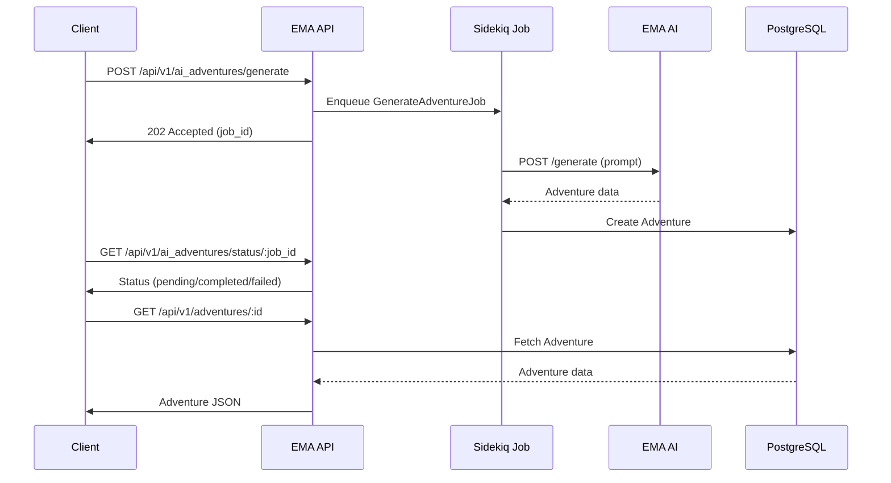
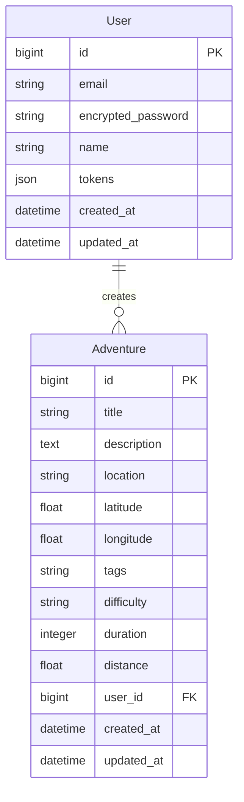

# Diagrammes d'architecture

## Architecture globale

```mermaid
graph TD
    Client[Client Web/Mobile] -->|HTTP/JSON| API[EMA API - Rails 8]
    API -->|HTTP/JSON| AI[EMA AI - Python/FastAPI]
    API -->|SQL| DB[(PostgreSQL)]
    API -->|Redis| Cache[(Redis)]

    subgraph "EMA API"
        Controllers[Controllers]
        Models[Models]
        Policies[Policies]
        Services[Services]
        Jobs[Background Jobs]

        Controllers --> Models
        Controllers --> Policies
        Controllers --> Services
        Services --> Jobs
        Jobs --> Services
    end
```

## Flux de génération d'aventure

```mermaid
sequenceDiagram
    participant Client
    participant API as EMA API
    participant Job as Sidekiq Job
    participant AI as EMA AI
    participant DB as PostgreSQL

    Client->>API: POST /api/v1/ai_adventures/generate
    API->>Job: Enqueue GenerateAdventureJob
    API->>Client: 202 Accepted (job_id)

    Job->>AI: POST /generate (prompt)
    AI-->>Job: Adventure data
    Job->>DB: Create Adventure

    Client->>API: GET /api/v1/ai_adventures/status/:job_id
    API->>Client: Status (pending/completed/failed)

    Client->>API: GET /api/v1/adventures/:id
    API->>DB: Fetch Adventure
    DB-->>API: Adventure data
    API->>Client: Adventure JSON
```

## Modèle de données

```mermaid
erDiagram
    User ||--o{ Adventure : creates

    User {
        bigint id PK
        string email
        string encrypted_password
        string name
        json tokens
        datetime created_at
        datetime updated_at
    }

    Adventure {
        bigint id PK
        string title
        text description
        string location
        float latitude
        float longitude
        string tags
        string difficulty
        integer duration
        float distance
        bigint user_id FK
        datetime created_at
        datetime updated_at
    }
```
